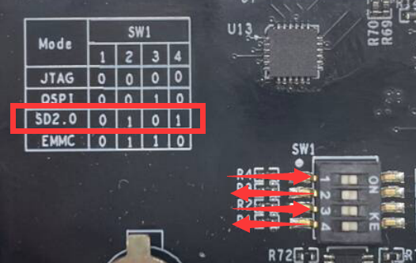
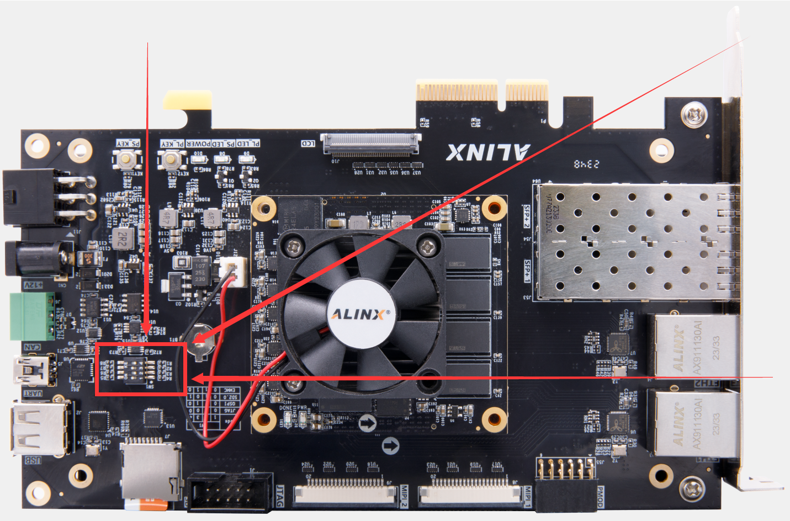
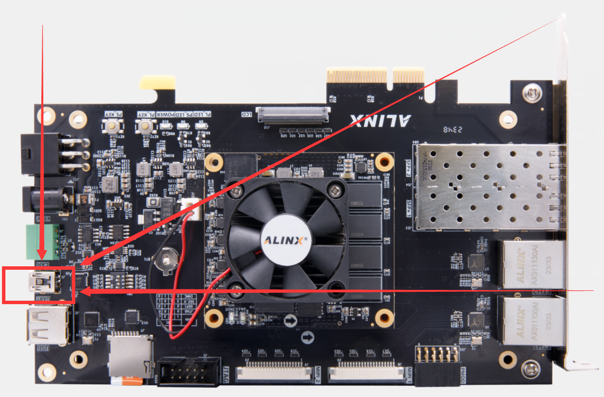
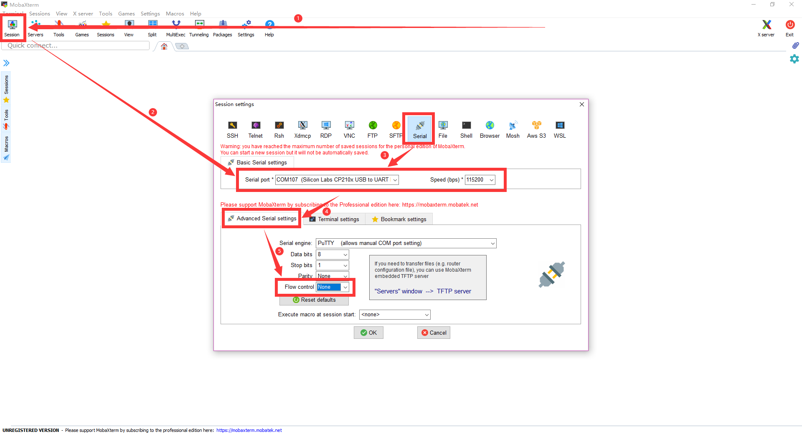

## Quickly start Linux-make an SD card to start the development board Linux system

---
### 1. Adjust the DIP switch
Adjust the DIP switch on the development board to boot from the SD card, as shown below:\
\
The DIP switch is at this location on the development board:\

---
### 2. Set up SD card partition
Next you need to make an SD card for booting Linux. Connect the SD card (for example, through a card reader) to the Ubuntu system, and then open the Disks tool in the Ubuntu system:\
\
My SD card is the **31 GB Drive** here. Select it, you can see that there are three areas in the SD card: \
a. FAT type partition named **BOOT**\
b. Ext4 type partition named **ROOTFS**\
c.Free Space\
\
This is the state we need. If your SD card is also in this state (there are no strict requirements on the size of the partition), you can skip this section directly and go to [3. Fill the SD card partition] (###3. Fill the SD card partition). But in order to demonstrate a complete process, I first restored the SD to a state without partitioning, selected the corresponding partition, and clicked the \" **-** \" icon to delete the current partition, and finally it became the state as shown below: \
\
Click the \" **+** \" icon to create a new partition. The first partition needs to be in **FAT** format, with a size of 2G and a name of **BOOT**:\
\
\
Click the **Create** button to complete partition creation, and click the \"**▶**\" button to mount the partition:\
\
Click **Free Space**, use similar steps to create a second partition, select **Ext4** as the format, allocate 20G in size (adjust according to your actual needs and restrictions), and name it **ROOTFS**: \
\
\
The final status is as shown below. Note that both partitions need to be mounted:\

---
### 3. Fill the SD card partition
After the SD card partition is completed, copy the files needed to start the system to the corresponding partition. \
Unzip *sdCardSystemFiles.zip* in [sdCardSystemFiles](../../sdCardSystemFiles) to obtain *boot.scr*, *BOOT.bin*, *image.ub*, *rootfs.tar.gz* and other files. \
Copy the three files *boot.scr*, *BOOT.bin*, *image.ub* to the **BOOT** partition: \
\
Extract *rootfs.tar.gz* to the **ROOTFS** partition with root permissions, **open the terminal in the path** where *rootfs.tar.gz* is located, and enter the following command: \
`sudo tar zxvf ./rootfs.tar.gz -C /media/alinx/ROOTFS/ && sync`\
\
\
Then eject the SD card from Ubuntu.

---
### 4. Start Linux
Insert the SD card you just created into the SD card slot of the development board: \
 \
Connect the UART of the development board to the PC (**CP210x driver [CP210x_Windows_Drivers.zip](../../drivers)** needs to be installed on the PC: \
 \
Open the serial port tool, select the COM port we just connected, set the baud rate to 115200, turn off flow control, and click the OK button: \
 \
Connect 12V power supply: \
 \
You can see the output information in the serial port tool: \
\
The system has been started successfully. Enter the username **petalinux**. When logging in for the first time, you will be prompted to enter the password and enter it again to confirm. After logging in, just use the password you entered for the first time. \

---
---
- Visit [ALINX official website](https://www.alinx.com) for more information.
